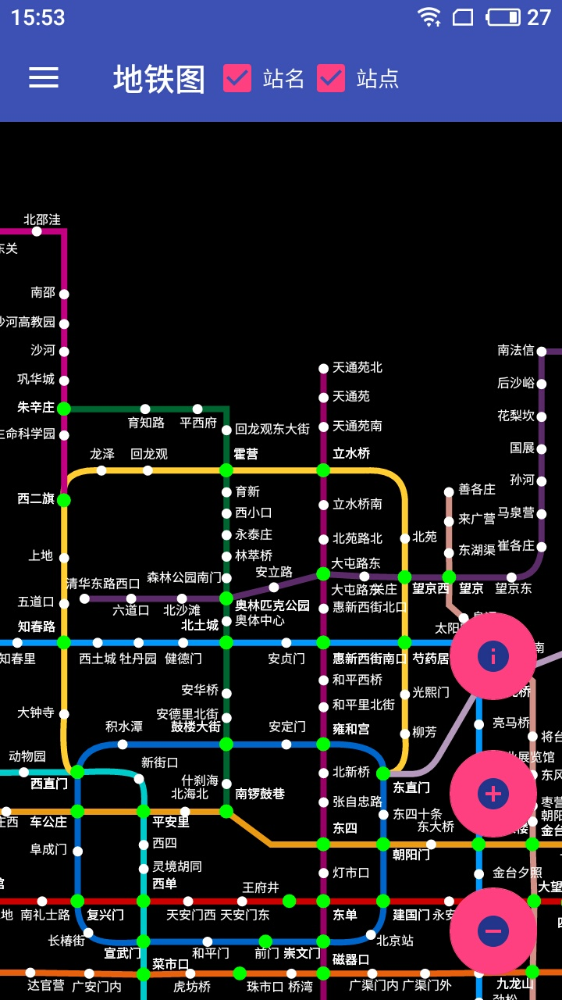
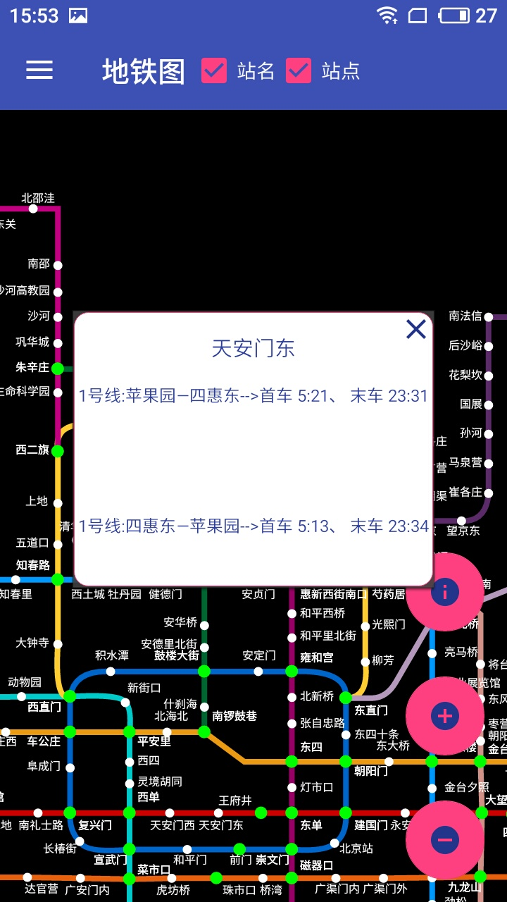
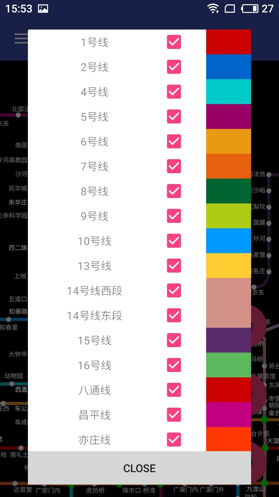
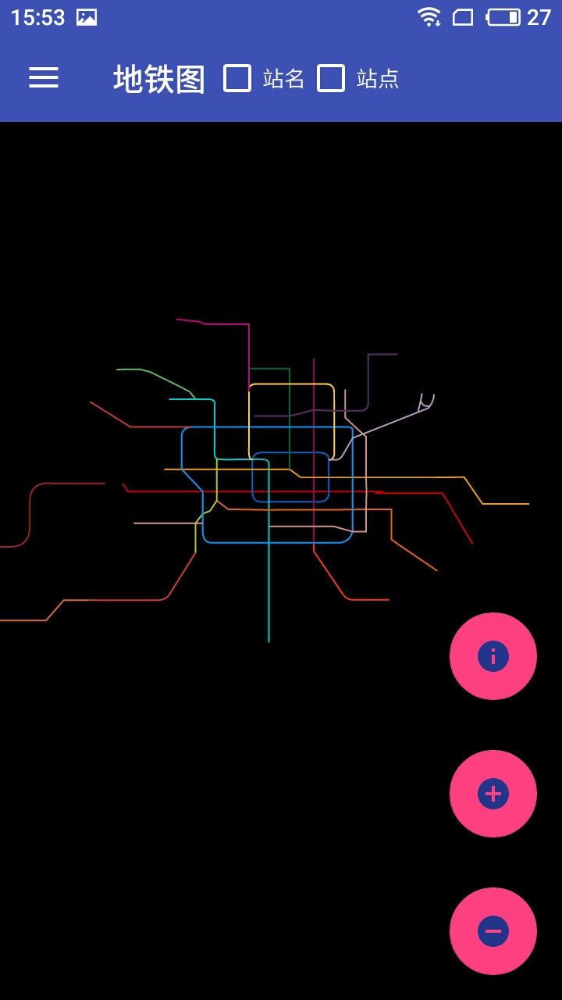
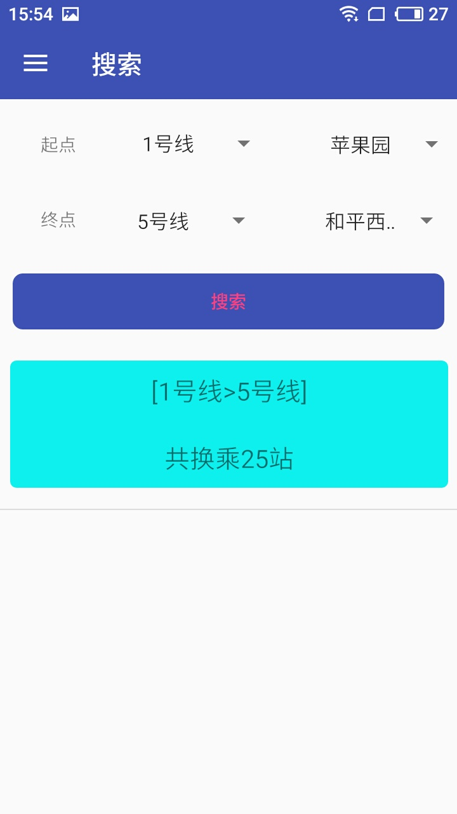
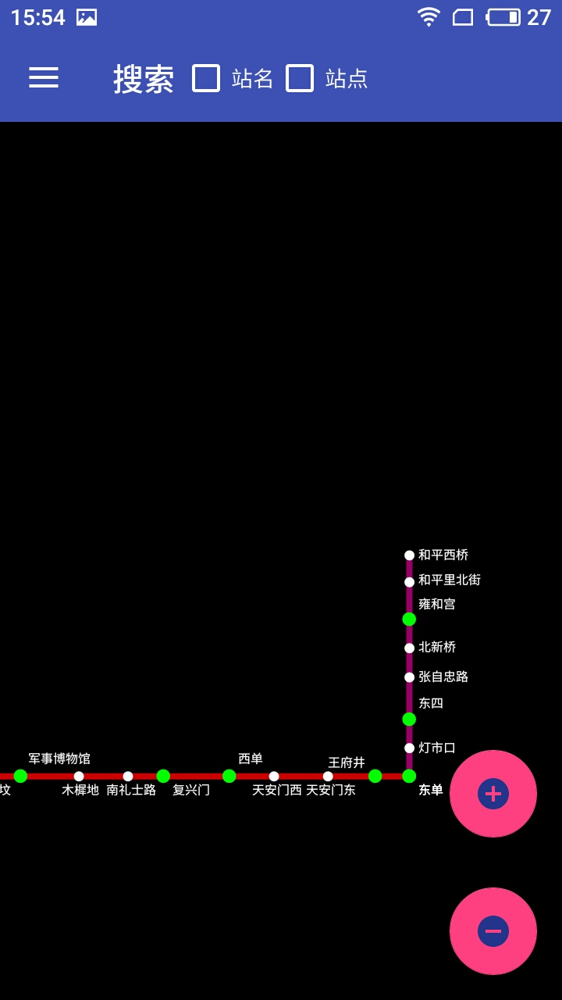

## beijing-subway
## 安卓自定义View绘制北京地铁图
### 实现的功能
<ul>
<li> 自定义绘制指定的地铁线路颜色、是否显示等等</li>
<li> 根据地铁起点站地铁终点站规划出换乘线路，画出对应的路线预览图</li>
</ul>

### 以下为预览效果图

## 体验地址
[酷安](https://www.coolapk.com/apk/com.yhongm.subway)

[谷歌play](https://play.google.com/store/apps/details?id=com.yhongm.subway)

